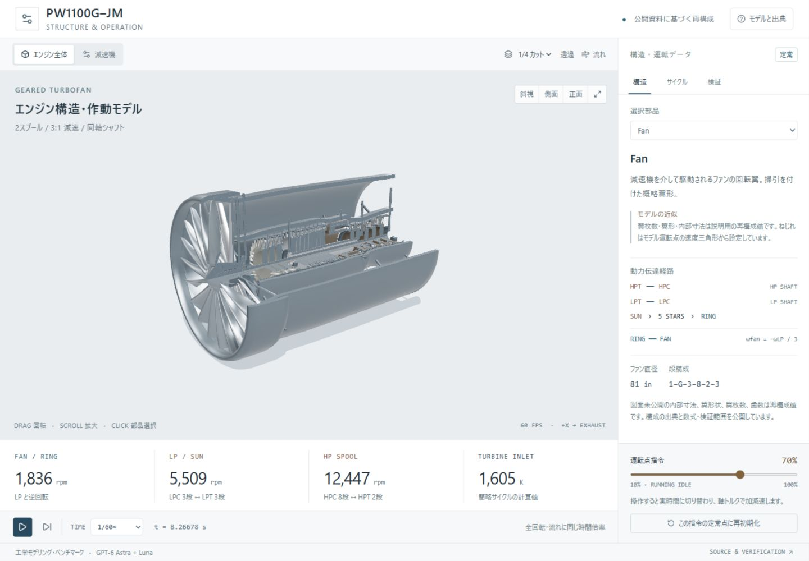

# PW1100G-JM Engineering Lab

[ブラウザで開く](https://naoyamd.github.io/pw1100g-jm-engine-lab/) · [検証記録](docs/VERIFICATION.md)

公開資料をもとに再構成した、PW1100G-JMのブラウザ用カットモデルです。
GPT-6 Astraが計画・統合・レビュー、Luna maxのワーカーが歯車・軸系形状・サイクルを担当しています。



81インチのファン、3段LPC、8段HPC、環状燃焼器、2段HPT、3段LPTを配置。
LP軸はサンギアを駆動し、固定中心の5個のスターを介して、内歯リングとファンを逆方向に減速駆動します。
HP軸は別の運動方程式で回転し、中空軸の中をLP軸が通ります。

初期表示はケース透過と1/4カット。全体・減速機・圧縮機・燃焼器・タービンの5つの検査ビュー、
外観・1/2カット、部品選択が使えます。拡大表示も同じエンジンの形状・軸系から切り出します。
コアとバイパスの連続した経路と移動矢印、全温・全圧・軸流速度の凡例と軸方向グラフで流れを確認できます。
17段の動翼には設計点の速度三角形と Euler 仕事、圧縮機・燃焼器・タービンには運転中のエネルギー収支を表示します。
一時停止・微小ステップ・時間倍率（1/1200、1/600、1/120、1/60、1/20、実時間）は全回転と流れに共通です。初期値は観察用の1/600です。
運転点指令を変えると、タービン出力と負荷の差が軸トルクになり、慣性に従って加減速します。
検証パネルでは、描画されたメッシュの角度、質量・エネルギー収支、軸出力の不均衡を確認できます。

## 再現する範囲

公開資料で確認した段構成、軸系、減速機方式と、説明用に構成した内部形状・サイクルを組み合わせています。
実機歯数、翼枚数、翼形、内部寸法、材料、慣性、性能マップは同定していません。
モデルの30/30/90歯・正確な3:1は、公開資料の「約3:1」と整合する成立例です。
絶対回転方向は座標系上の規約です。

サイクルは固定ノズル面積と合成特性を用いた一次元の概念モデルです。
数値収支の成立は、実機性能や強度の保証を意味しません。
始動・停止、FADEC、失速・サージ、詳細な燃焼化学、CFD、熱変形、歯面・軸受寿命やFEM強度解析は対象外です。
流れの矢印は断面平均速度を積分するトレーサーで、翼まわりの渦や個々の分子を表しません。
速度三角形は翼の取付角を定める固定設計入力です。翼面上の流れを解いた結果ではありません。

実施日は **2026-09-05（JST）**。画面下部に、このタスクとサブエージェントのトークン集計を小さく記録しています。
集計時点、キャッシュの扱い、モデル別内訳は[ベンチマーク記録](docs/BENCHMARK.md)を参照してください。

## ローカルで実行

Node.js 24を使用します。

```sh
npm ci
npm run dev
```

表示先は `http://127.0.0.1:4173/` です。

```sh
npm run check
npm run build
```

GitHub Pagesではワークフローが型検査、lint、数値・形状テスト、静的ビルドを実行してから公開します。
サブディレクトリ用ビルドは `GITHUB_PAGES=true npm run build` と `npm run prepare-pages` で生成します。
出力は `dist/client/` です。
Windows で確認したビルド終了時の制約は[検証記録](docs/VERIFICATION.md)を参照してください。

## 設計と根拠

- [受入条件と一次資料](ENGINEERING_PLAN.md)
- [歯車の歯形・位相・支持構造](docs/GEAR.md)
- [段構成・翼・軸・流路の形状](docs/GEOMETRY.md)
- [サイクルと回転運動の数式](docs/PHYSICS.md)
- [構成要素の診断と流れ表示](docs/COMPONENTS.md)
- [実施日とトークン集計](docs/BENCHMARK.md)
- [実行した検証と制約](docs/VERIFICATION.md)

主な参照元は[P&W製品資料](https://prd-sc102-cdn.rtx.com/prattwhitney/-/media/pw/newsroom/collateral/documents/commercial-engines/pw_gtf_pc_pw1100g-jm.pdf)、
[IHI技報](https://www.ihi.co.jp/technology/techinfo/contents_no/__icsFiles/afieldfile/2023/06/16/dfa646fceb7705a3c159683b20eb8b2b.pdf)、
[ASMEのGTF解説](https://www.asme.org/getmedia/1838965b-aa81-41ff-ad77-c06c31984cbd/1221mem-web.pdf)、
[EASA型式資料](https://www.easa.europa.eu/en/document-library/type-certificates/engine-cs-e/easaime093-pw1100g-jm-series-engines)、
[NASA Glennの熱力学資料](https://www1.grc.nasa.gov/beginners-guide-to-aeronautics/conservation-of-energy/)です。
各社が制作・承認した製品ではありません。
